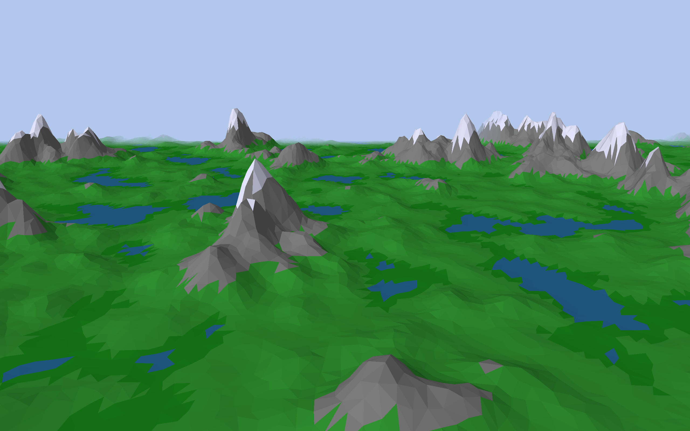

# Artemis

[](https://forthebadge.com) [](https://forthebadge.com)

Low-Poly Procedural Terrain Generation



## Getting Started

### 1. Install [GLFW](https://www.glfw.org/) and [glm](https://glm.g-truc.net/)
If you are on macOS and have homebrew installed you should be able to do this with:
```shell
brew install glfw
brew install glm
```

### 2. Build the Project
Again, if you are on macOS the following should work as is:
```shell
make
./build/Artemis
```
Otherwise you have to change the `Makefile` accordingly.

## Acknowledgments

Inspired by:
* [Procedurally Generating Stylized Farmland Scenes](https://www.cs.williams.edu/~morgan/cs371-f16/gallery/4-midterm/terrain/report.md.html)
* [Unity Lowpoly Environments](https://polycount.com/discussion/187752/unity-lowpoly-environments)

Third Party Libraries:
* [FastNoise](https://github.com/Auburns/FastNoise)
* [delabella](https://github.com/msokalski/delabella)
* [Poisson Disk Sampling](https://github.com/thinks/poisson-disk-sampling)

## License

This project is licensed under the MIT License - see the [LICENSE.md](LICENSE.md) file for details.
Copyright 2019 © Q. Kniep, A. Harrisson
